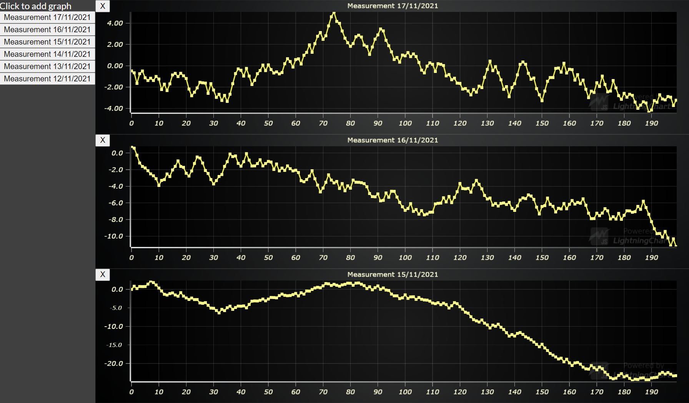

# JavaScript Dynamic Chart Dashboard

This demo application belongs to the set of examples for LightningChart JS, data visualization library for JavaScript.

LightningChart JS is entirely GPU accelerated and performance optimized charting library for presenting massive amounts of data. It offers an easy way of creating sophisticated and interactive charts and adding them to your website or web application.

The demo can be used as an example or a seed project. Local execution requires the following steps:

- Make sure that relevant version of [Node.js](https://nodejs.org/en/download/) is installed
- Open the project folder in a terminal:

        npm install              # fetches dependencies
        npm start                # builds an application and starts the development server

- The application is available at *http://localhost:8080* in your browser, webpack-dev-server provides hot reload functionality.

## Description

Example on how a dynamic chart dashboard can be created with LightningChart JS.

The use case is an application where charts can be added and removed at users whim to perform different kinds of analysis within a dynamic application setting.

This can be achieved out of the box with LightningChart by placing each chart in its own HTML DIV in same way as most web charts on the market. However, the purpose of this example is to show how to utilize the LightningChart JS Dashboard component to achieve the same purposes with the absolute best performance.

The performance problem with placing each chart in its own DIV is that all plotting preparation has to be done separately. LC JS Dashboard was specifically designed to be the answer to this problem - it allows efficient sharing of plotting resources and processes to greatly increase the loading speed of charts (with 10 charts, up to 100% faster) as well as run-time performance.

Generally, LC JS Dashboards are static sized (for example, 2x2 grid) and size can't be changed afterwards. However, with some creative coding this limitation can be worked around by preallocating the Dashboard for some number of "maximum charts" and then programmatically resizing the Dashboard cells which actually have charts in them, which is exactly what we do in this example.

## API Links

* [Dashboard]
* [XY cartesian chart]
* [Line series]
* [Axis]
* [Translate point]

## Support

If you notice an error in the example code, please open an issue on [GitHub][0] repository of the entire example.

Official [API documentation][1] can be found on [Arction][2] website.

If the docs and other materials do not solve your problem as well as implementation help is needed, ask on [StackOverflow][3] (tagged lightningchart).

If you think you found a bug in the LightningChart JavaScript library, please contact support@arction.com.

Direct developer email support can be purchased through a [Support Plan][4] or by contacting sales@arction.com.

[0]: https://github.com/Arction/
[1]: https://www.arction.com/lightningchart-js-api-documentation/
[2]: https://www.arction.com
[3]: https://stackoverflow.com/questions/tagged/lightningchart
[4]: https://www.arction.com/support-services/

© Arction Ltd 2009-2020. All rights reserved.

[Dashboard]: https://www.arction.com/lightningchart-js-api-documentation/v3.3.0/classes/dashboard.html
[XY cartesian chart]: https://www.arction.com/lightningchart-js-api-documentation/v3.3.0/classes/chartxy.html
[Line series]: https://www.arction.com/lightningchart-js-api-documentation/v3.3.0/classes/lineseries.html
[Axis]: https://www.arction.com/lightningchart-js-api-documentation/v3.3.0/classes/axis.html
[Translate point]: https://www.arction.com/lightningchart-js-api-documentation/v3.3.0/globals.html#translatepoint

